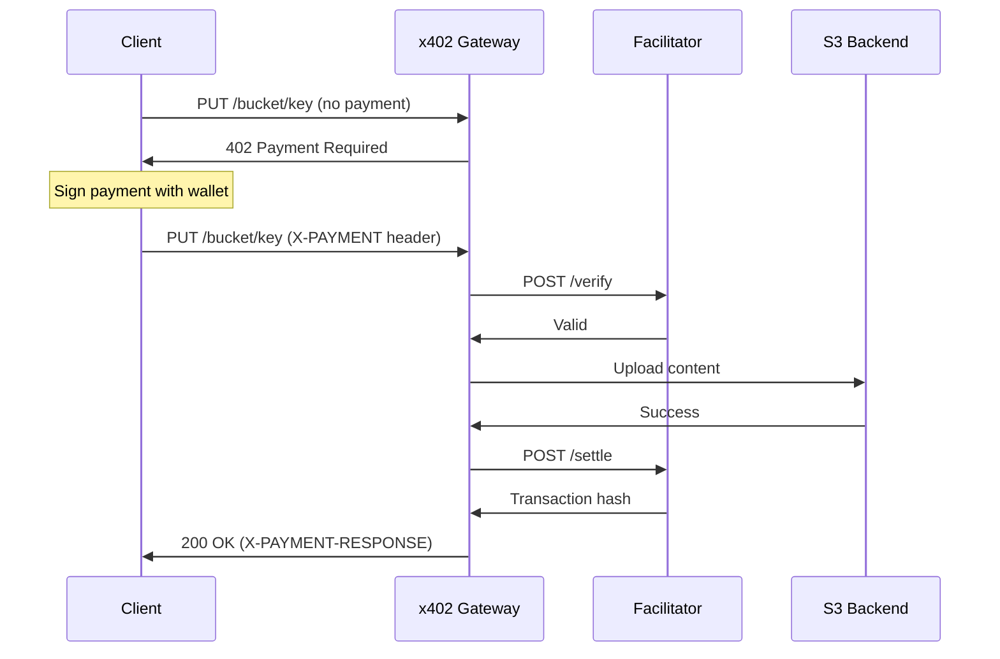

# x402 Payment Flow
{: .no_toc }

## Table of contents
{: .no_toc .text-delta }

1. TOC
{:toc}

---

## Flow Overview



---

## Step 1: Initial Request

Send your upload request without payment to get requirements:

```bash
curl -X PUT "https://x402.api.cloud.fx.land/mybucket/myfile.txt" \
  -H "Content-Type: text/plain" \
  -H "Content-Length: 1024" \
  -H "X-Fula-TTL: 3600" \
  -d "File content here"
```

---

## Step 2: Receive 402 Response

The server responds with HTTP 402 and payment requirements:

### Response Headers

```
HTTP/1.1 402 Payment Required
X-PAYMENT-REQUIRED: eyJ4NDAyVmVyc2lvbiI6MSwi...
```

### Response Body

```json
{
  "x402Version": 1,
  "accepts": [
    {
      "scheme": "exact",
      "network": "eip155:324705682",
      "maxAmountRequired": "10000",
      "payTo": "0xRecipientAddress",
      "asset": "eip155:324705682/erc20:0xTokenAddress",
      "description": "Storage: 0.01 MB for 1 hour",
      "mimeType": "application/octet-stream",
      "maxTimeoutSeconds": 300,
      "resource": "https://x402.api.cloud.fx.land/mybucket/myfile.txt",
      "extra": {
        "facilitatorUrl": "https://facilitator.dirtroad.dev",
        "name": "Bridged USDC (SKALE Bridge)",
        "version": "1"
      }
    }
  ],
  "error": "Payment Required"
}
```

### Payment Requirements Explained

| Field | Description |
|:------|:------------|
| `x402Version` | Protocol version (always 1) |
| `scheme` | Payment type - `exact` means pay exact amount |
| `network` | CAIP-2 network identifier |
| `maxAmountRequired` | Amount in microUSDC (10000 = $0.01) |
| `payTo` | Recipient wallet address |
| `asset` | CAIP-19 token identifier |
| `maxTimeoutSeconds` | Time to complete payment (300 = 5 min) |
| `extra.facilitatorUrl` | URL for payment verification |

---

## Step 3: Construct Payment

Create a signed payment payload following the x402 spec.

### Payment Structure

```json
{
  "x402Version": 1,
  "scheme": "exact",
  "network": "eip155:324705682",
  "payload": {
    "signature": "0x...",
    "authorization": {
      "from": "0xPayerAddress",
      "to": "0xRecipientAddress",
      "value": "10000",
      "validAfter": "0",
      "validBefore": "1705320300",
      "nonce": "0x..."
    }
  }
}
```

### Signing

The payment must be signed using EIP-712 typed data:
- Domain separator from USDC token contract
- Authorization struct typed data

---

## Step 4: Send Payment

Retry your request with the signed payment:

```bash
curl -X PUT "https://x402.api.cloud.fx.land/mybucket/myfile.txt" \
  -H "Content-Type: text/plain" \
  -H "Content-Length: 1024" \
  -H "X-Fula-TTL: 3600" \
  -H "X-PAYMENT: eyJ4NDAyVmVyc2lvbiI6MSwi..." \
  -d "File content here"
```

### Alternative Header

You can also use:
```
Payment-Authorization: x402 eyJ4NDAyVmVyc2lvbiI6MSwi...
```

---

## Step 5: Verification

The gateway verifies your payment with the facilitator:

```
POST https://facilitator.dirtroad.dev/verify
{
  "paymentPayload": "<base64-payment>",
  "paymentRequirements": {
    "scheme": "exact",
    "network": "eip155:324705682",
    "maxAmountRequired": "10000",
    ...
  }
}
```

Verification checks:
- Signature is valid
- Amount meets requirement
- Payment hasn't expired
- Nonce not already used

---

## Step 6: Content Upload

If verification passes:
1. Content uploaded to S3 backend
2. Ephemeral record created with TTL
3. CID computed for IPFS addressing

---

## Step 7: Settlement

After successful upload, payment is settled:

```
POST https://facilitator.dirtroad.dev/settle
{
  "paymentPayload": "<base64-payment>",
  "paymentRequirements": {...}
}
```

Settlement transfers USDC from payer to recipient on SKALE.

---

## Step 8: Success Response

### Response Headers

```
HTTP/1.1 200 OK
X-PAYMENT-RESPONSE: eyJzdWNjZXNzIjp0cnVlLC4uLn0=
```

### Response Body

```json
{
  "success": true,
  "cid": "QmYwAPJzv5CZsnA625s3Xf2nemtYgPpHdWEz79ojWnPbdG",
  "bucket": "mybucket",
  "key": "myfile.txt",
  "size_bytes": 1024,
  "expires_at": "2024-01-15T11:30:00.000Z",
  "tx_hash": "0xabc123...",
  "gateway_url": "https://ipfs.cloud.fx.land/ipfs/QmYwAP..."
}
```

### X-PAYMENT-RESPONSE Decoded

```json
{
  "success": true,
  "transaction": "0xabc123...",
  "network": "eip155:324705682"
}
```

---

## Timing

| Step | Timeout |
|:-----|:--------|
| Payment validity | 300 seconds (5 minutes) |
| TTL minimum | 60 seconds |
| TTL maximum | 2,592,000 seconds (30 days) |
| TTL default | 3,600 seconds (1 hour) |

---

## Error Recovery

### Payment Rejected

If verification fails:
- You receive 402 with error details
- Your funds are NOT transferred
- Create a new payment and retry

### Upload Failed

If upload fails after verification:
- Payment is NOT settled
- Your funds are NOT transferred
- Retry with a new payment

### Settlement Failed

If settlement fails after upload:
- Content IS uploaded
- Payment status is logged
- Contact support with transaction details
